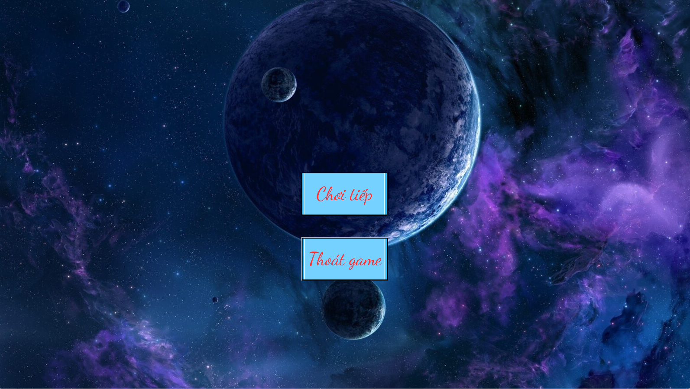
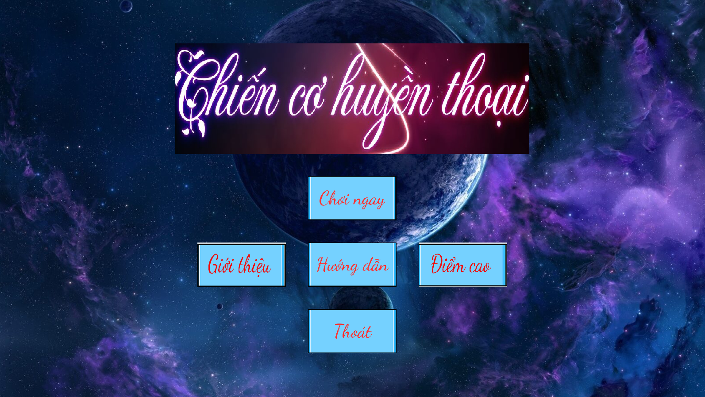
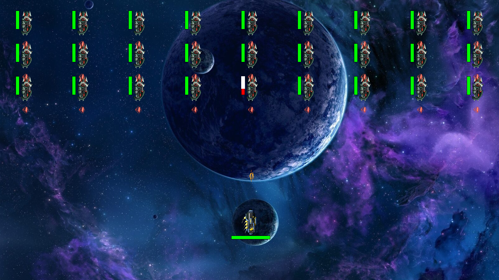
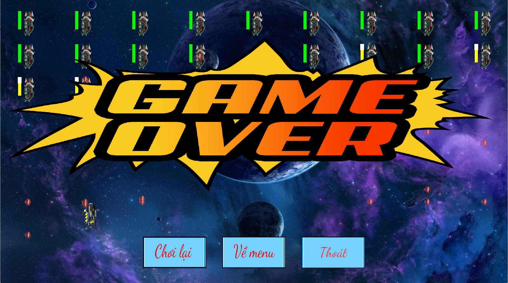

# Chiến cơ huyền thoại
### Video Demo : 
## Các mục chính  
* [Hướng dẫn cài đặt](#setup)
* [Mô tả chung](#info)
* [Các chức năng](#detail)
* [Kỹ thuật lập trình](#tech)
* [Các hướng đi trong tương lai](#future)
* [Kết luận](#summary)
* [Lời cảm ơn](#thanks)

* <a name="setup"/>
## 1. Hướng dẫn cài đặt : 
- Để tải về trò chơi, từ phần repositories của mình, các bạn click vào thư mục file_goc và tải về
- Tải về SDL tại đây : , sau khi tải về các bạn 
- Để khởi động trò chơi, từ file rar đã tải về, các bạn giải nén file

* <a name="info"/>
## 2. Mô tả chung  

### Giới thiệu
- Chiến cơ huyền thoại (Space Legend) được lấy cảm hứng tựa game nổi tiếng Chicken Invader của nhà InterAction, trong đó bạn sẽ phải điều khiển chiến hạm siêu hạng của mình để tiêu diệt đám quái vật xấu xa
- Với tinh thần quảng bá Game Việt ra thế giới, toàn bộ giao diện của game sẽ là tiếng Việt

### Về GamePlay  
- Bạn sẽ phải điều khiển chiến hạm siêu hạng của mình để tiêu diệt đám quái vật xấu xa
- Sau khi tiêu diệt một đợt quái, đợt quái kế tiếp sẽ có máu và sát thương cao hơn nên khó có thể bị tiêu diệt hơn
- Cần phải điều khiển con tàu của mình thật cần thận, nếu không sẽ bị dính làn đạn tử thần của kẻ thù
- Số lượng quái vật trong vũ trụ là vô tận, vì vậy trò chơi sẽ không bao giờ kết thúc trừ khi bạn thua. Vì vậy, cần phải tiêu diệt nhiều tàu nhất có thể để trở thành huyền thoại
- Trò chơi kết thúc khi HP của tàu mình trở về 0

 * <a name="detail"/>
## 3. Các chức năng
Để tạm dừng game đang chơi, nhấn ESC. 

### 1. Giao diện Menu  
- Giao diện chính bao gồm 4 chức năng : Chơi ngay, Hướng dẫn, về game và Thoát
- Mỗi giao diện đều có 1 nhạc nền khác nhau phù hợp với nội dung của từng chức năng

### 2. Giao diện trò chơi  
- Dùng chuột để điều khiển con tàu, tiêu diệt tàu địch

### 3. Giao diện gameover  
- Khi hp về 0, giao diện Gameover sẽ xuất hiện
- Lúc này ta có thể chọn về Menu, chơi lại hoặc thoát game
- Một bản nhạc du dương sẽ vang lên để xoa dịu một lih hồn đã tử trận nơi chiến trường

* <a name="tech"/>
## 4. Kỹ thuật lập trình  
### Xây dựng trên nền tảng C++ và SDL2 bao gồm: 
- SDL_Mixer: Hỗ trợ xử lý âm thanh.  
- SDL_Ttf: Hỗ trợ xử lý fonts chữ.  
- Các thư viện mở rộng C++.  
- Sử dụng một trong những IDE tốt nhất cho lập trình : Code Block 20.3.  

### Các kỹ thuật lập trình  
- Gồm tất cả các kỹ thuật cơ bản:  
- Biến (static, extern), vòng lặp, cấu trúc rẽ nhánh, mảng, chuỗi.  
- Class: Tạo, hủy, member function.  
- Multithreading: Xử lý chức năng Battle. 
- Kỹ thuật giải phóng bộ nhớ động.  

### Ứng dụng
- Mỗi chức năng của game (Play Single, Battle, Setting, Helps), mỗi Khối hình (Tetrads) được xác định bằng 1 đối tượng (class) riêng biệt.   

- <a name="future"/>
## 5. Các hướng đi trong tương lai  
### Nâng cấp nhiều tính năng hơn 
- Hiện tại game vẫn đang thiếu rất nhiều tính năng từ cơ bản đến nâng cao, mình sẽ cố gắng nâng cấp thêm nhiều tính năng hơn ở các bản cập nhật tiếp theo  
- Thêm tính năng ải ngẫu nhiên : Chơi theo ải đã được lập trình sẵn sẽ cho người chơi cảm giác thấy chán, vì vậy mình dự định sẽ bổ sung thêm hệ thống trộng tàu ngẫu nhiên để người chơi không thể đoán trước được độ khó của ải  
- Thêm tính năng thay đổi nhạc : Đôi lúc, người chơi muốn đổi nhạc nền để thay đổi tâm trạng chơi, vì vậy, trong các bản cập nhật sau, mình sẽ tính đến việc nanng cấp tính năng này  

### Đa dạng hoá tàu + Chiêu thức của tàu + Các option đi kèm
- Chơi 1 tàu cũng sẽ gây ra nhằm chán, vì vậy mình sẽ cập thêm tàu mới, đa dạng hoá lối chơi cho game  
- Tàu cũng sẽ có thêm chiêu thức để tạo bất ngờ cho mỗi lần chơi  
- Các option đi kèm sẽ giúp người chơi vượt ải dễ hơn  

### Thương mại hoá trò chơi
- Việc cập nhật tàu mới và các option mới cũng sẽ đồng nghĩaw với việc người chơi phải nạp tiền để mua những vật phẩm này. Về lâu về dài, tác giả cũng cần chút tiền để đầu tư và phát triển game nữa   
- Người chơi sẽ nạp tiền vào game, số tiền sẽ chuyển thẳng vào tài khoản nhà phát hành.  
- Tiền nạp sẽ chuyển hóa thành Coin với tỷ lệ tương ứng, hoặc những vật phẩm có giá trị tương đương.  
- Có thể dùng Coin để đổi các vật phẩm sau: option hiếm, các vật phẩm nâng cấp tàu, tàu mới v,v ...  

* <a name="summary"/>
## 6. Kết luận
Game được viết bởi Huỳnh Lê Nghĩa - một trong những sinh viên tài năng của trường Đại học Công nghệ, có sự học hỏi từ lazyfoo,chatGPT, phattrienphanmem123   
- Nguồn cung cấp asset cho game : 
- craftpix
- Printerest
- ephoto
- Canva pro
- Google Image
### Việc hoàn thiện 1 dự án lập trình như thế này giúp em mở mang kiến thức rất nhiều. 
- Hiểu được mô hình phát triển 1 phần mềm kiểu thác nước: Phân tích, thiết kế, lập trình, kiểm thử, chuyển giao và bảo trì (forever).  
- Sử dụng thành thạo class, pointer, chia tách file,... 
- Cách dùng github. 
- Học rất nhiều syntax, thuật toán mới của c++. 
- Hiểu sơ sơ một số khía cạnh của lập trình hướng đối tượng: kế thừa, đa hình,... 
- Hình thành tư duy xử lý và giải quyết bài toán 

Đây cũng là tựa game đầu tay mà mình làm, cho nên trong game vẫn còn rất nhiều thiếu sót, cũng như kỹ năng lập trình của mình chưa được cao, rất mong mọi người đóng góp ý kiến và bỏ qua để mình tiếp tục hoàn thiện và cố gắng trong  thời gian sắp tới 

* <a name="thanks"/>
## 7. Lời cảm ơn
Cuối cùng mình xin chân thành cảm ơn thầy cô, bố mẹ và các bạn đã giúp mình hoàn thành dự án lớn đầu tiên này
Mình xin cảm ơn chân thành sâu sắc đến :  
- Thầy Lê Đức Trọng  
- Thầy Trần Trường Thuỷ  
- Anh Đặng Tiến Dũng  
- Các bạn mam đẹp trai của phòng G304  
- Bạn Gờ Pi Tê - senior developer  
- Và các bạn lớp K68-J  
- ## Mình xin trân trọng cảm ơn thầy cô đã dành thời gian lắng nghe.  
